# Machine Learning Interactive Academy · أكاديمية تعلّم الآلة التفاعلية

**Developed by Dr. Marwan Roudane · تطوير: الدكتور مروان رودان**

An Arabic, interactive, university-level Machine Learning platform built with Streamlit — from ML readiness to
production — with an independent, in-depth track on **Double/Debiased Machine Learning (DML)**.
Companion to the Data Science platform [DSplat](https://dsplat.streamlit.app/) and sharing its design system.

**Open the app · افتح المنصة: [mlplat.streamlit.app](https://mlplat.streamlit.app/)**

[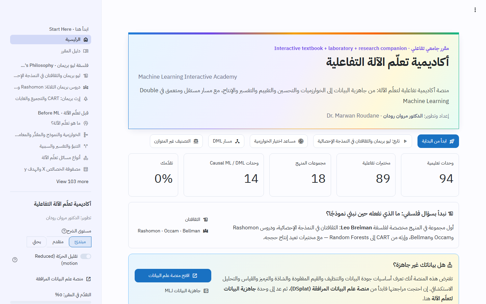](https://mlplat.streamlit.app/)

## Design · التصميم

- **Arabic first, right to left.** Explanations are in Arabic; code, formulas and technical terms stay in English, left to
  right.
- **One light theme shared with DSplat.** The fonts are IBM Plex Sans Arabic and JetBrains Mono, the primary colour is
  `#1971C2`, and cards and buttons have 10 px rounded corners. The palette is defined in `.streamlit/config.toml` and
  `assets/css/theme.css`.
- **Every module opens with the same card:** learning objectives, estimated time, level and prerequisites. Most modules
  then add intuition boxes, an interactive lab, a quiz and exercises.
- **Animations have play/pause, step, reset and speed controls,** plus a *Reduced motion* switch in the sidebar.
- **Three levels of explanation** (beginner, advanced, research) are chosen from the sidebar and change how deep each
  page goes.
- **The layout adapts to phones** (see the last screenshot below).

<table>
  <tr>
    <td width="50%">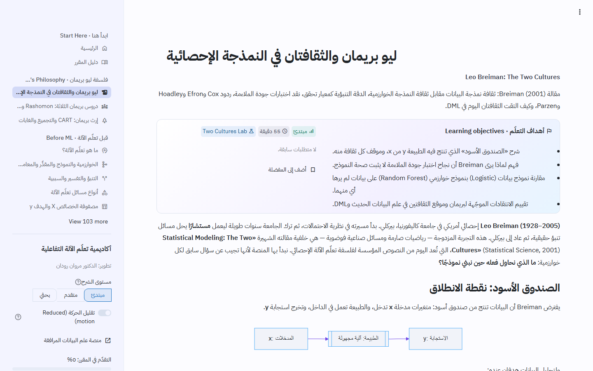<br>
      <sub><b>Leo Breiman's philosophy</b>: the Two Cultures module, with its learning-objectives card</sub></td>
    <td width="50%">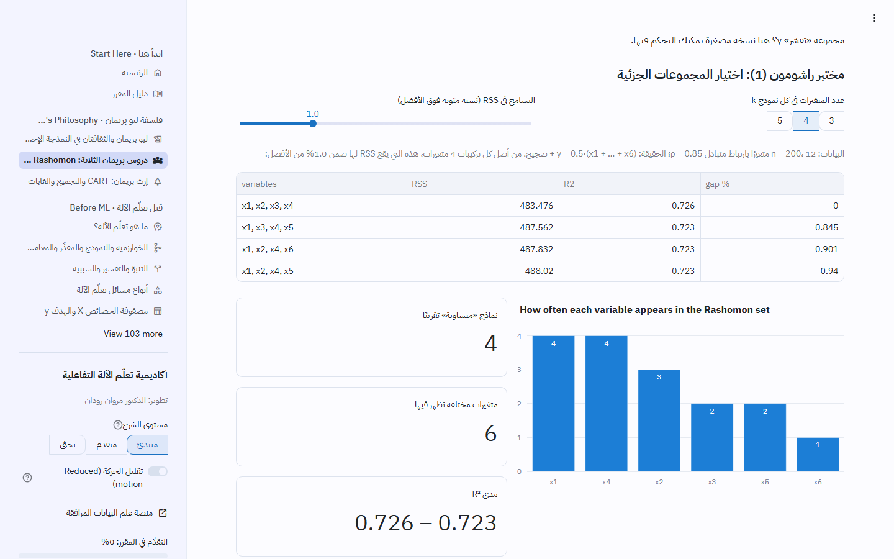<br>
      <sub><b>Rashomon lab</b>: many subsets fit almost equally well</sub></td>
  </tr>
  <tr>
    <td>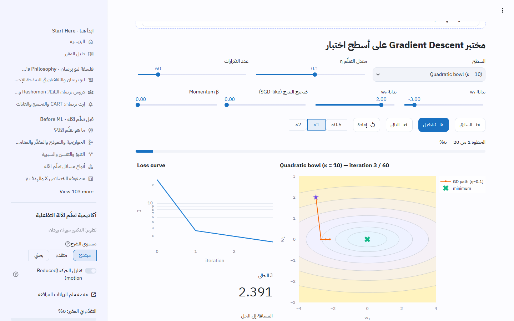<br>
      <sub><b>Gradient Descent lab</b>: the path over the loss surface, step by step</sub></td>
    <td>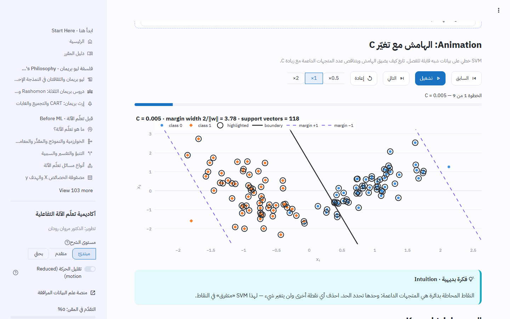<br>
      <sub><b>SVM</b>: the margin and support vectors as C changes</sub></td>
  </tr>
  <tr>
    <td>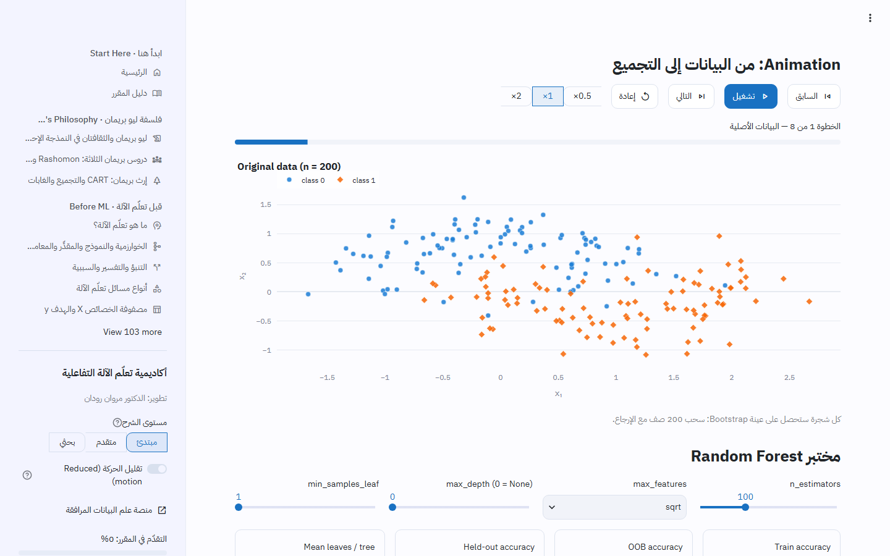<br>
      <sub><b>Random Forest</b>: from bootstrap samples to the aggregated vote</sub></td>
    <td>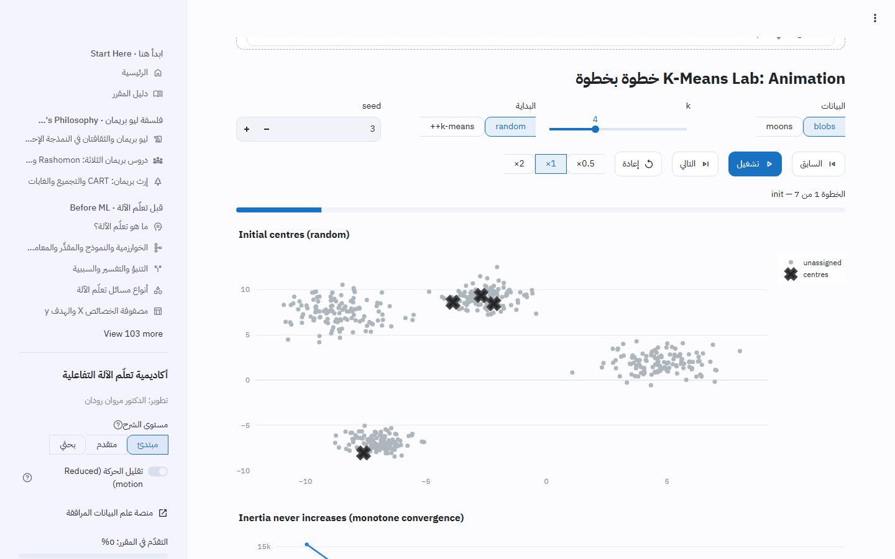<br>
      <sub><b>K-Means</b>: assignment and update steps; inertia never increases</sub></td>
  </tr>
  <tr>
    <td>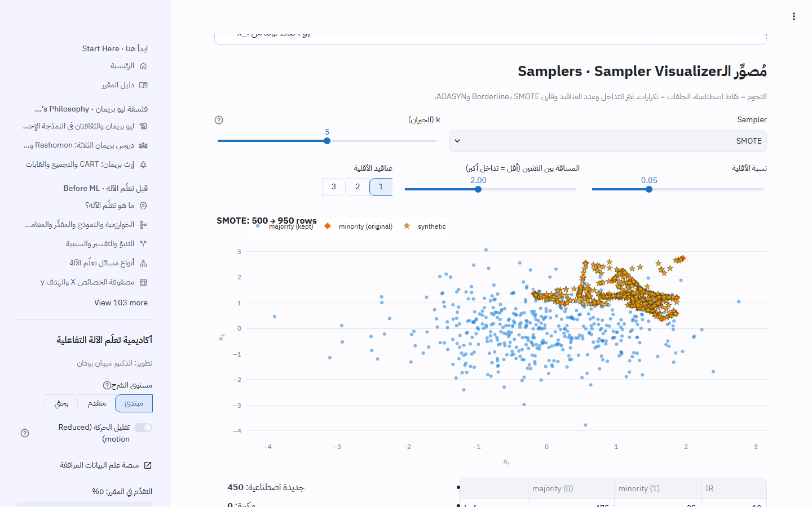<br>
      <sub><b>Imbalanced classification</b>: the sampler visualizer (SMOTE, Borderline, ADASYN…)</sub></td>
    <td>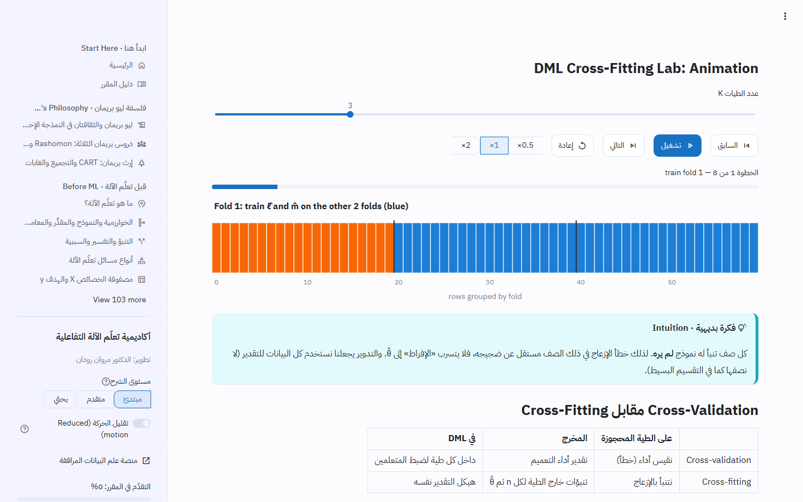<br>
      <sub><b>Double ML</b>: the cross-fitting animation</sub></td>
  </tr>
  <tr>
    <td>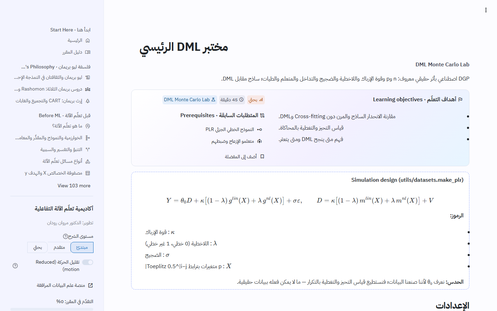<br>
      <sub><b>DML Monte Carlo lab</b>: a known data-generating process, with bias and coverage measured</sub></td>
    <td>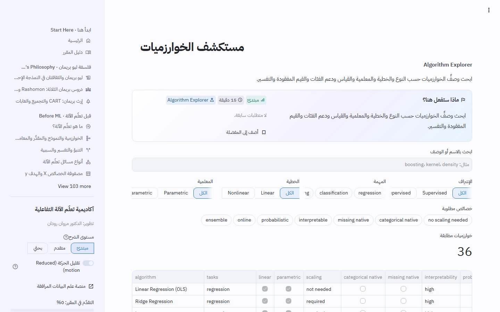<br>
      <sub><b>Algorithm Explorer</b>: filter 36 algorithms by task, linearity, scaling and native support</sub></td>
  </tr>
</table>

<p align="center">
  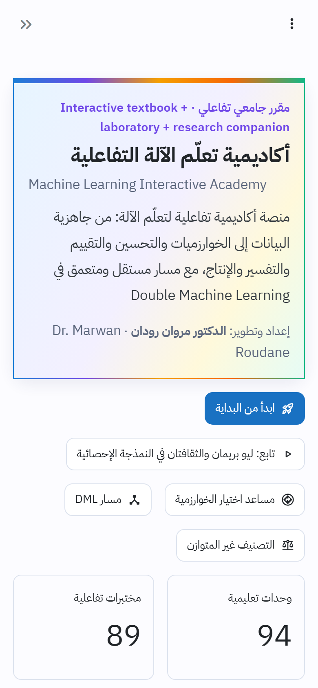<br>
  <sub>The same home page on a phone</sub>
</p>

## Purpose

An interactive textbook + laboratory + university course + algorithm explorer + research companion for professors,
researchers, graduate students and learners moving from data science to modelling. Explanations are in Arabic;
technical terms, code and math stay in English (LTR).

## Curriculum (113 pages, 18 groups)

Start · **Leo Breiman's philosophy** (the two cultures; Rashomon, Occam and Bellman; his legacy from CART to
random forests) · Before ML (readiness, baselines, splits, 9 types of leakage, pipelines) · Math & statistical learning (linear
algebra, calculus, probability, statistics, ERM, bias–variance, losses, learning theory) · Optimization (GD/SGD/mini-batch,
Newton, L-BFGS, coordinate descent, early stopping) · Supervised (OLS, polynomial/splines, Ridge/Lasso/Elastic Net, robust,
logistic, Naive Bayes, LDA/QDA, kNN, SVM) · Trees & ensembles (CART, bagging/stacking, RF/Extra Trees, AdaBoost/GB, HGB,
XGBoost, LightGBM, CatBoost, benchmark) · Validation & evaluation (CV + nested CV, metrics, thresholds, calibration,
feature selection, conformal prediction) · **Imbalanced classification** (10 modules: nature of imbalance, metrics,
cost-sensitive learning, SMOTE family, under-sampling and cleaning, balanced ensembles, calibration and prior shift,
multi-class and extreme rarity, workflow and benchmark lab) · HPO (grid/random/halving, Bayesian/Optuna, encyclopedia) ·
Unsupervised (K-Means, hierarchical, DBSCAN/HDBSCAN, GMM, PCA, Kernel PCA/NMF/t-SNE, anomaly detection) ·
Interpretability (permutation importance, PDP/ICE, SHAP) · **Causal ML & DML (14 modules)** · Modern topics & bridges
(semi-supervised, active, online, time series, text, RL, deep learning) · Production (systems, MLOps, drift, fairness,
reproducibility) · Labs · 10 projects + 2 capstones · Resources.

See `docs/curriculum.md` (generated from the registry).

## Installation

```bash
python -m venv .venv
.venv\Scripts\activate          # Windows; use `source .venv/bin/activate` on macOS/Linux
pip install -r requirements.txt
```

Tested on Python 3.11 with scikit-learn 1.9.1, Streamlit 1.64.0, pandas 3.0.6, numpy 2.4.6 (versions verified 2026-09-23).

### Optional extras

`xgboost`, `lightgbm`, `catboost`, `optuna`, `shap`, `imbalanced-learn`, `DoubleML`, `econml` are listed in
`requirements.txt` but are optional: without them every page still renders theory, reference code and an install hint.
Minimal install: `pip install -r requirements-core.txt`. With pip extras: `pip install ".[all]"`.

## Running

```bash
streamlit run streamlit_app.py
```

## Tests

```bash
python -m pytest
```

Suites: curriculum integrity, content hygiene (no placeholders, no `eval/exec`, light theme, identity), datasets,
metrics vs scikit-learn, optimizers, from-scratch models, **DML vs DoubleML on identical folds**, hyperparameter
defaults vs installed libraries, report generation, headless render of every page, a test that clicks every button on
every page, all 10 projects, and every optional library simulated as missing.

## Deployment

Live at https://mlplat.streamlit.app/ (Streamlit Community Cloud, main file `streamlit_app.py`, Python 3.11/3.12). See
`docs/deployment.md`.

## Adding modules, labs and algorithms

See `docs/architecture.md` → *Adding content*. In short: register the module in `core/curriculum.py`, create the page
with `page_header`/`page_footer`, add quizzes/exercises, put computations in `utils/` with tests, and run
`python scripts/build_docs.py` and `python -m pytest`.

## Documentation

`docs/architecture.md`, `docs/curriculum.md`, `docs/datasets.md`, `docs/references.md`, `docs/research_notes.md`,
`docs/research_matrix.md`, `docs/algorithm_matrix.md`, `docs/hyperparameters.md`, `docs/deployment.md`, `CHANGELOG.md`.

---
© Dr. Marwan Roudane — Machine Learning Interactive Academy
